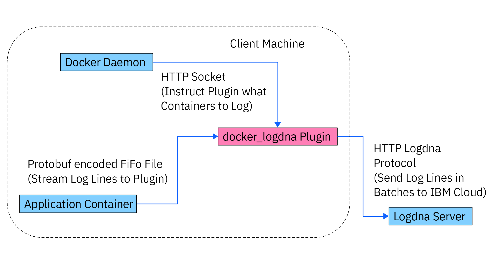

# docker_logdna
Logdna logging driver Docker plugin.



## What are you looking at?
This is a Docker logging plugin.
That means you can install it using `docker plugin install --alias logdna ghcr.io/ibm/docker-logdna:latest` after which it will run alongside the Docker daemon in a containerized environment.
But you won't find it with `docker ps` as it isn't a Docker image like [Logspout](https://github.com/logdna/logspout).

When the plugin is **enabled** the Docker daemon takes care of starting and stopping it.
You can change the enabled status using `docker plugin enable logdna` and `docker plugin disable logdna`.
While it is enabled all Docker containers can use logdna like any other logging driver.
The `json-file` for example is the default logging driver but there are many other [pre-installed logging drivers](https://docs.docker.com/config/containers/logging/configure/#supported-logging-drivers).
You can define what logging driver to use with the `--log-driver` argument and provide [configurations](#docker-compose-and-the-config) with `--log-opt`.
So you can for example do this: `docker run --log-driver logdna --log-opt logdna_host=logs.eu-de.logging.cloud.ibm.com --log-opt api_key=YOUR_API_KEY hello-world`
If you really want, you can also set logdna as the [default logging driver](https://docs.docker.com/config/containers/logging/configure/#configure-the-default-logging-driver).

To uninstall the plugin run `docker plugin disable logdna` and `docker plugin remove logdna`.

I gave a talk presenting the docker_logdna plugin.
[The slides](https://ibm.github.io/docker_logdna/2024_02_09_ibm_docker_logdna) can be viewed using a browser.

## Docker Compose and the Config
If you prefer docker compose, do this:
```yaml
version: "3"

services:
  app:
    image: hello-world
    logging:
      driver: logdna
      options:
        ### required ###

        # the logdna server host address
        logdna_host: logs.eu-de.logging.cloud.ibm.com
        # the logdna api key
        api_key: YOUR_API_KEY

        ### optional ###

        # when undefined use this machines hostname
        hostname: test-hostname
        # left out when undefined
        ip: 123.123.123.123
        # left out when undefined
        mac: 0014a541616b
        # left out when undefined
        tags: i,like,cheese
        # use container name when undefined
        app: my-fancy-app
        # left out when undefined
        # one of TRACE, DEBUG, INFO, WARN, ERROR, FATAL
        level: FATAL
        # cap log lines to this length
        # don't limit line length when 0 is provided
        # when undefined cap length to 8192 characters
        max_length: 69420
        # set this to true when testing the mocking logdna server for testing purposes
        # disables HTTPS
        for_mock_server: false
        # after what time to flush log lines to logdna (in milliseconds)
        # when undefined send after 250ms
        flush_interval: 250
        # after how many bytes of log to flush log lines to logdna
        # when undefined send after 2MB
        max_buffer_size: 2097152
        # logdna http request timeout (in milliseconds)
        # when undefined time out after 30sec
        http_client_timeout: 30000
        # how often to retry sending lines to logdna
        # when undefined retry five times
        max_request_retry: 5
```

## How to Build
This section is for when you're interested in building and publishing the docker_logdna plugin.
Following these instructions will also run [Clippy](https://doc.rust-lang.org/stable/clippy/index.html) and all unit tests.
They do not contain the full [end-to-end test using Docker-in-Docker](#end-to-end-test-using-docker-in-docker).

The plugin is being built inside Docker using the [Dockerfile](./Dockerfile).
You need to run this:
```bash
mkdir plugin/rootfs && \
    docker build -t rootfsimage . && \
    docker export $(docker create rootfsimage true) | tar -x -C plugin/rootfs && \
    docker plugin create logdna ./plugin && \
    sudo rm -r plugin/rootfs && \
    docker plugin enable logdna
```

When you're running this a second time you will end up with an error because you haven't `docker plugin disable logdna` and `docker plugin remove logdna`.

To see the log of the plugin, run `journalctl --output cat -fu docker.service` or `journalctl --user --output cat -fu docker.service` on Docker rootless.
So the full single-line command for "quick" development is:

```bash
sudo docker plugin disable -f logdna && \
    docker plugin rm -f logdna && \
    mkdir plugin/rootfs && \
    docker build -t rootfsimage . && \
    docker export $(docker create rootfsimage true) | tar -x -C plugin/rootfs && \
    docker plugin create logdna ./plugin && \
    sudo rm -r plugin/rootfs && \
    docker plugin enable logdna && \
    journalctl --output cat -fu docker.service
```

More information on building plugins can be found in the [Docker documentation](https://docs.docker.com/engine/extend).

When you run `cargo test` on your host machine, make sure ports `9000` to `9500` are vacant, as they are being used for testing.

If you want to push the plugin to this repo use `docker plugin push ghcr.io/ibm/docker-logdna:YOUR_VERSION`.
That is `docker plugin push [...]` and not `docker push [...]`.

## Testing on the Host
Install the logdna plugin and start [a log-producing Docker container](./mock/client) and a [logdna mock server](./mock/server).

## End-to-End Test using Docker-in-Docker
While this section doesn't provide you with a built version of the docker_logdna plugin—like [the build instructions](#how-to-build) do—it runs all clippy, unit and end-to-end tests.
Docker in Docker allows you to run an entire, separate Docker daemon inside a Docker container.
I'll call this daemon **dind**.

What this test does is spin up such a Docker daemon container and a test runner container.
The test runner builds, clippy-tests, unit-tests and installs the plugin (into dind); after which many logdna mock servers and [happily log producing clients](./mock/client) are created.
These clients are all separate docker containers running under the dind daemon.

To start the test simply run `docker compose up --abort-on-container-exit --exit-code-from test_client` in the repo's root directory.

Warning:
Docker-in-Docker is very flaky and crashes often.
When the test fails check the logs, `docker compose down` and try again—it might very well be a problem with dind that doesn't affect the actual logdna plugin and any production deployment.

The test can be configured in [dind_test_driver/src/main.rs](#dind_test_driver/src/main.rs).

## Performance Limits and Comparison to Logspout
The Docker logdna plugin makes very efficient use of your resources.
Thanks to Rust compiling down to a native binary and the use of Alpine Linux as the base image the plugin consumes a merely 19MB of storage.
Additionally, since it is so closely entangled with the Docker daemon, using the docker_logdna plugin doesn't hamper Docker's performance.
Using the async tokio runtime the plugin shouldn't consume any CPU cycles when it's only waiting for new log lines and distributes the load on all available cores evenly.

Here are the results from stress tests on an Intel i7-10750H twelve-threaded CPU with 32GB RAM:
-   Sending 1_000_000 lines of 100 characters as fast as possible (with `docker compose down && docker compose up -d && \time ../server/target/release/mock_server`) takes:
    - the docker plugin: 17.69sec -> that makes 56_529 lines/sec
    - logspout: 23.27sec -> which makes 42_973 lines/sec
    
    The same test with 10_000_000 lines takes:
    - the docker plugin: 166.60sec -> which makes 60_024 lines/sec
    - logspout: 239.46sec -> that makes 41_760 liens/sec
    
    So the plugin can send roughly 44% more lines per second as a sustained load.
-   The IBM logdna server isn't a bottleneck and lets the 60_000 lines a second through without a problem.
-   Docker splits a log line into multiple somewhere between 8000 and 8500 characters.
-   Docker in Docker is extremely unreliable.
    The [End-to-End dind test](#end-to-end-test-using-docker-in-docker) very often fails due to dind.
-   Compiling rust takes forever.

## Additionally...
The hostnames for IBM's logdna log aggregators are `logs.private.eu-de.logging.cloud.ibm.com` for internal and `logs.eu-de.logging.cloud.ibm.com` for external use.

You can use some of these commands for debugging the plugin:
- Get ids of all running plugins: `sudo runc --root /run/docker/runtime-runc/plugins.moby list`
- Enter shell in plugin: `sudo runc --root /run/docker/runtime-runc/plugins.moby exec -t c62c456ac371685e84d2f98e41f29d39bb762c193ef80eb6925a111797f6fc4e sh`
- Test Docker http communication with curl: `sudo curl -H "Content-Type: application/json" -XPOST -d '{}' --unix-socket /var/run/docker/plugins/c62c456ac371685e84d2f98e41f29d39bb762c193ef80eb6925a111797f6fc4e/plugin.sock http://localhost/LogDriver.StartLogging`
- Ping socket: `nc -U ./plugin.sock -z`
- More restrictive plugin logs: `journalctl --user --output cat -fu docker.service | grep 'plugin='`

